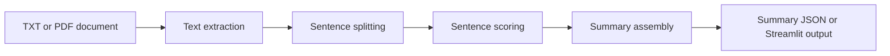

# Architecture

The project has three layers:

- Local extractive summarizer for fast, deterministic demos.
- Optional Streamlit app for document upload and interactive summaries.
- Optional BART-large fine-tuning script for abstractive summarization.

## Baseline

The baseline scores sentences using token frequency and position weighting, then selects high-value sentences until the word budget is reached.

## Fine-Tuned Model

The BART script tokenizes document-summary pairs and trains a sequence-to-sequence model. It is intended for GPU environments and larger labeled datasets.

